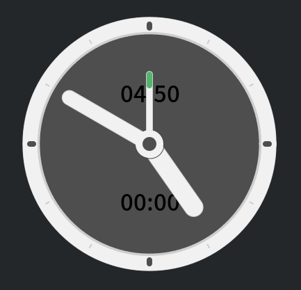

# Cairo-Timer

## 安装

- 喜欢自己动手的，自己**编译**。需要安装libcanberra-dev库，编译命令：

```
cd bin.old;   valac --pkg gtk+-3.0 -X -lm --pkg libcanberra timer.vala
```

- 或者，使用meson+ninja**编译和安装**：

```
meson build --prefix=/usr;    cd build;    sudo ninja install;
```
- 或者，直接**安装**  `Cairo-Timer-1.0.deb` 。

---

集合`定时器`和`闹钟⏰`功能。
> 以前经常使用at脚本设置提醒，每次还要开终端，输入命令。这个单一执行文件，可以解决一般性的定时问题。
> 比如："*12分钟后提醒*"；"*5点45提醒*"。都是鼠标在同一界面操作。

GPL3 授权。gtk+-3.0下编译的，源码在其他仓库。当前Linux发行版本应该通用。其他平台不知道安装了gtk环境能跑不。

## 应用场景

- 闹钟：**启动**软件，鼠标**右键点击**钟表的表面，设定好闹铃时间，点击圆心**开启**闹钟，滚轮缩小钟面或者直接去做自己的事情。

- 定时：**启动**软件，在圆心部分，**滚轮向上**增加定时的分钟，击圆心开启**激活**定时，做其他事情去。

- Alarm: **start** software, **right click** the surface of clock, set the alarm time, click the center to **activate**, scroll wheel to reduce the clock face or do your own things directly.

- Timer: **start** software. In the center part, **roll up** to increase timing minutes. Click the center to **activate**, finish.

## 鼠标操作

 

* 圆心部分：
    * `1`鼠标主键切换提醒`开关`，时间文字和定时指针会变颜色，指示开关的状态。
    * `4/5`键滚轮设置以当前时间为基础，`设置定时`，每次正负一分钟。正向定时，会显示"+10"分钟这样的状态。
    * 其他鼠标按钮，`关闭`软件。
* 其他界面部分：
    * `1`鼠标主键`拖动`。
    * `4/5`键滚轮`缩放`。
    * 其他鼠标按钮，`点选定时`，以五分钟为间隔。

## 提醒动作
* 缺省执行`/usr/bin/canberra-gtk-play -l 5 -i complete`，就是系统声音，连续响5次。如果不关闭提醒，大约会响一分钟。在某些没有这命令的系统上，会执行`/usr/bin/paplay /usr/share/sounds/freedesktop/stereo/alarm-clock-elapsed.oga`来提醒。
* 如果有自定义脚本，`~/.config/time.script`，提醒动作就会执行它。不管shell格式。最好别设置`totem xxxx.mkv`这样的，软件会多次载入的，除非脚本里面自己搞定重载判断。因为提醒脚本是为了让人在没取消前，多次提醒。

## 新增参数
* 参数为 x, y, z, 0，或者无参数(缺省为z)。表示提醒时，摇摆的方向轴。


> 软件10秒激活一次，所以最大延时误差是10秒。

>虽然界面丑点，其实只是为了不调用任何外部资源。

